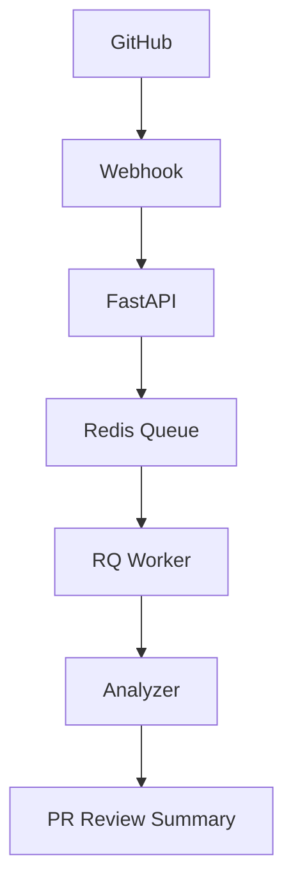

# AI Code Review Agent

AI Code Review Agent is a FastAPI-based GitHub webhook service that receives pull request events, enqueues review work in Redis, processes files in an RQ worker, and posts a combined review summary back to the pull request.

## Project Overview

The project automates lightweight code review for pull requests. GitHub sends a webhook to FastAPI, FastAPI queues the review job in Redis, the RQ worker fetches changed files and runs the analyzer, and the worker posts one summarized PR comment.

## Architecture Diagram

### Architecture Image Placeholder

Insert an architecture image here for the final portfolio version.



## Architecture Explanation

The request path stays short while the review path stays asynchronous. FastAPI only receives and validates webhook payloads, then hands work off to Redis-backed RQ so the API remains responsive. The worker performs the expensive part of the pipeline: retrieving PR files from the head branch, analyzing content, aggregating findings across all files, and publishing a single review comment.

For interview use, the important design point is separation of concerns. The webhook receiver, queue, worker, and analyzer are intentionally simple and isolated, which makes the pipeline easier to operate, debug, and scale independently.

## Features

- GitHub webhook ingestion for pull request events
- Asynchronous review execution through Redis and RQ
- Pull request file retrieval from the PR head branch
- Security, quality, and best-practice checks
- Aggregated PR review summary with severity levels
- Single PR comment per review run

## Tech Stack

- Python 3.11
- FastAPI
- Uvicorn
- Redis
- RQ
- PyGithub
- Docker
- Docker Compose

## Project Structure

```text
app/
	main.py                  FastAPI application entrypoint
	api/webhook.py           GitHub webhook receiver
	github/github_client.py   GitHub API helpers
	workers/analyzer.py       Content checks and findings
	workers/review_worker.py  Queue worker and PR summary builder
	utils/logger.py           Shared logging helper
docker-compose.yml         Local container orchestration
Dockerfile                 Python application image
README.md                  Project documentation
requirements.txt           Python dependencies
```

## Installation

1. Clone the repository.
2. Create a `.env` file from `.env.example`.
3. Set `GITHUB_TOKEN` in the `.env` file.

## Running Locally

### With Docker

```bash
docker compose up --build
```

This starts the FastAPI app, Redis, and the worker container.

### Without Docker

```bash
pip install -r requirements.txt
uvicorn app.main:app --host 0.0.0.0 --port 8000 --reload
```

Run the worker in a second terminal when testing the queue-based flow.

## Screenshots

Add screenshots here after deploying the app locally or to your target environment.

## Demo GIF

Insert a short demo GIF here for the final portfolio version.

## Resume Bullet Points

- Built an end-to-end GitHub PR review pipeline using FastAPI, Redis Queue, and an RQ worker.
- Aggregated findings across changed files into a single severity-ranked PR summary.
- Added duplicate comment prevention, review analytics, and persistent review history storage.
- Containerized the full stack with Docker and Docker Compose for repeatable local deployment.

## Interview Questions

- Why did you separate the webhook receiver from the worker?
- How does Redis improve the reliability of the review pipeline?
- How do you avoid posting duplicate PR comments?
- How do you keep the review output concise and useful for developers?
- What would you change if the analyzer had to support more rules or higher traffic?

## Future Improvements

- Add richer rule configuration for analyzer checks
- Add automated tests for webhook and worker flows
- Persist review history for analytics and traceability
- Add a retry policy and dead-letter handling for failed jobs
- Improve severity scoring and file-level summaries